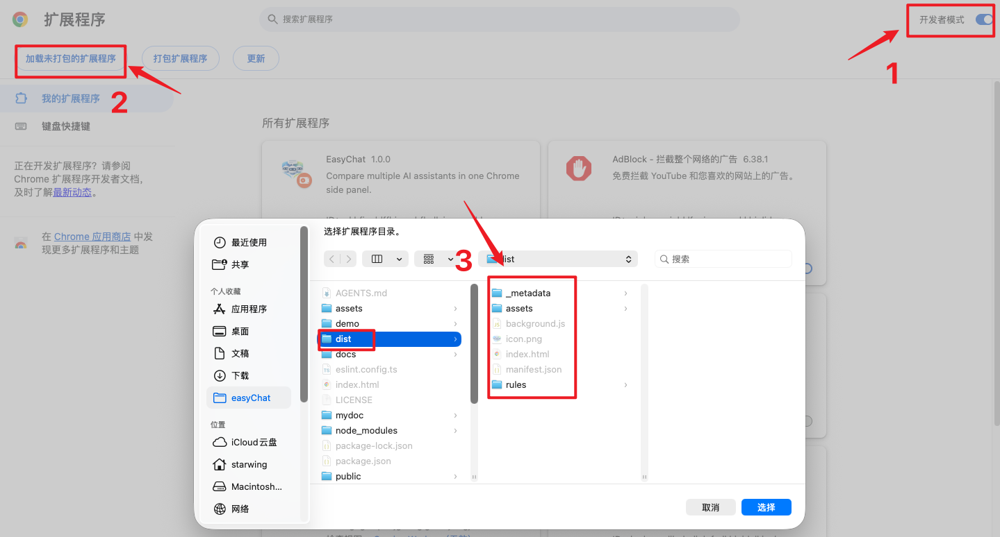

# EasyChat

**让 AI 对话变得更简单 —— 在侧边栏中与顶级模型并行聊天，免费，本地，定制化** ✨

[![作者][作者-image]][作者-url]
[![许可证][许可证-image]][许可证-url]

[作者-image]: https://img.shields.io/badge/author-starwingChen-blue.svg
[作者-url]: https://github.com/starwingChen
[许可证-image]: https://img.shields.io/github/license/starwingChen/easyChat?color=blue
[许可证-url]: https://github.com/starwingChen/easyChat/blob/master/LICENSE

[简体中文](README.md) | [English](README.en.md)

## ✨ 特点

- ⌨️ **支持快捷键**，`Alt`+`J` 随时呼出 / 收起
- 🔑 **模拟 web 请求调用模型，无「免费次数」套路**，用量全在你自己的账号上
- 🔌 **可配置 API key**，让对话更可控
- ⚡ **多模型并排展示**，对比回答快人一步
- ↔️ **面板可拖拽**，怎么顺手怎么来
- 📜 **支持历史会话**，一键查看过往消息
- 🌐 **中 / 英** 界面随时切换
- 📦 **≲1MB**，轻到离谱
- 🤖 ChatGPT、Gemini、DeepSeek、Copilot、Perplexity… **持续更新中**

## 🎬 GIF演示

## 🖼️ 截图

<b>历史会话</b>

<b>多模型对比</b>

<b>支持 Api 机器人配置</b>

## 📦 安装

### 方式一：前往 Chrome 商店 (推荐)

[https://chromewebstore.google.com/detail/easychat/lkejjfnabnjbchpgmfbalnhdjofkkgif](https://chromewebstore.google.com/detail/easychat/lkejjfnabnjbchpgmfbalnhdjofkkgif)

### 方式二：Release 安装

- 前往 [Release](https://github.com/starwingChen/easyChat/releases)，在最新版本中下载 `dist.zip`
- 解压文件
- 前往 [chrome://extensions](chrome://extensions/)，打开开发者模式，加载解压后的文件夹
  

### 方式三：本地安装

- 克隆源代码
- 运行 `npm install`
- 运行 `npm build`
- 将 `dist` 文件夹加载到浏览器中
- 欢迎提交 pr 😀

_简单好用，给常在网页里「问一句」的你。_

> 友链：[linux.do](https://linux.do/)
